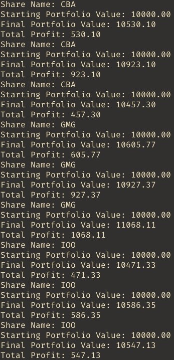
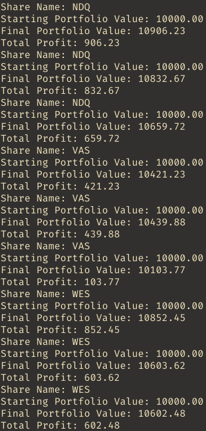
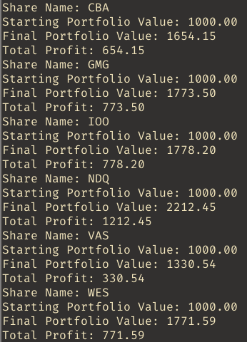

<h1 align="center">Day Trading Bot</h1>

## About The Project

The motivation behind creating this project is to create a day trading bot that will be optimised to perform well in the stock market. This is a journey to teach myself day trading and how different strategies will perform in the stock market and teach the importance of backtesting and optimising the day trading bot.

### Built With

* [![Python][Python]][Python-url]

## Getting Started

### Prerequisites

* [Python](https://www.python.org/downloads/)
* [Backtrader](https://www.backtrader.com/)
* [yfinance](https://pypi.org/project/yfinance/)

### Installation

1. Clone the repo
	```sh
	git clone https://github.com/TvDragon/day-trading-bot.git	
	```
2. Install the python packages
	```sh
	pip install -r requirements.txt
	```

## Usage


## Roadmap

- [x] Backtest a simple strategy
- [x] Backtest scalping strategy
- [ ] Backtest trending strategy
- [ ] Implement a day trading bot
	- [ ] Trending strategy
	- [ ] Scalping strategy
- [ ] Optimise day trading bot

## Results

### Backtest Simple Strategy

This simple strategy involved placing a buy order only if the current open price is lower than the previous open price. When testing for daily, weekly and monthly intervals for placing trades the results had a positive yield making profits. The results are displayed below with the plotted graphs which can be viewed inside the `results/simple` folder and the order executions inside the `order-execs/simple` folder.




Viewing the results we can see that this strategy provided a positive yield making profits although there were times when placed orders ended up causing a net loss due to sell order placed at market price waiting for order execution. In the future this could be improved on by ensuring a large enough profit will be made before placing a sell order to cater for market price sell order placed. Additionally, this strategy puts the risk per trade at potentially losing all its value if share prices continue to plummet downwards. This is extremely risky with the potential to lose all our money.

To implement this onto the day trading bot we would need to determine what timeframe would be best used for this strategy.

### Backtest Scalping Strategy

This scalping strategy involved the use of three exponential moving averages: 25, 50 and 100 period. This was tested for the daily intervals where we looked for existing trends where all three lines needed to be heading in the same direction either in an uptrend or downtrend and the candles are outside of the EMAs. During an uptrend when prices make a pullback to below the 25 or 50 EMA this acts as our entry setup. Once the price goes back to the 25 EMA we take a buy position. Setting a stop-loss at the 50 EMA and the take-profit at 1.5 times that of the stop-loss. However if the price falls below the 100 EMA we cancel our setup. During a downtrend when prices make a pullback to above the 25 or 50 EMA this acts as our entry setup. Once the price falls back to the 25 EMA we take a sell position. Setting a stop-loss at the 50 EMA and the take-profit at 1.5 times that of the stop-loss. However if the price rises above the 100 EMA we cancel our setup. Additionally, we set a duration for how long to hold onto the buy or sell option as part of the exit strategy if we fail to hit either the stop-loss or take-profit.

The results displayed below show a positive yield making profits. The plotted graphs can be viewed inside the `results/scalping` folder and the order executions inside the `order-execs/scalping` folder which when calculated had a win-rate of 53%.



When comparing the scalping strategy against the simple strategy the combined profits for the daily interval from the scalping strategy yielded $4520.43 whereas the simple strategy yielded $3787.11. Although this may indicate that the scalping strategy works better compared to the simple strategy we also need to take into consideration that the simple strategy takes fewer trades because it attempts to always make a profit as part of its exit strategy. These results could change if an appropriate stop-loss and take-profit is setup as part of the exit strategy.

Although this strategy provided positive yeld making profits changes made to determining when we are in an uptrend or downtrend and prices for stop-loss and take-profit could potentially yield higher profits which would need to be tested.

To implement this into the day trading bot the timeframe that would be used is either 1 minute or 5 minute timeframes.

### Backtest Trending Strategy

## Contact

Tony Vo - tonyvo249@gmail.com

## Acknowledgements


[Python]: https://img.shields.io/badge/Python-ECD53F?style=for-the-badge&logo=python&logoColor=3776AB
[Python-url]: https://www.python.org/downloads/
