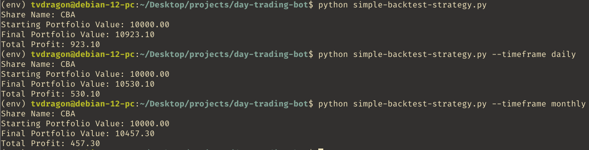

<h1 align="center">Day Trading Bot</h1>

## About The Project

The motivation behind creating this project is to create a day trading bot that will be optimised to perform well in the stock market. This is a journey to teach myself day trading and how different strategies will perform in the stock market and teach the importance of backtesting and optimising the day trading bot.

### Built With

* [![Python][Python]][Python-url]

## Getting Started

### Prerequisites

* [Python](https://www.python.org/downloads/)
* [Backtrader](https://www.backtrader.com/)
* [yfinance](https://pypi.org/project/yfinance/)

### Installation

1. Clone the repo
	```sh
	git clone https://github.com/TvDragon/day-trading-bot.git	
	```
2. Install the python packages
	```sh
	pip install -r requirements.txt
	```

## Usage


## Roadmap

- [x] Backtest a simple strategy
- [ ] Backtest trending strategy
- [ ] Backtest scalping strategy
- [ ] Implement a day trading bot
	- [ ] Trending strategy
	- [ ] Scalping strategy
- [ ] Optimise day trading bot

## Results

### Backtest Simple Strategy

This simple strategy involved placing a buy order only if the current open price is lower than the previous open price. When testing for daily, weekly and monthly intervals for placing trades the results had a positive yield making profits. The results are displayed below with the plotted graphs which can be viewed inside the `results` folder and the order executions inside the `order-execs` folder.



Viewing the results we can see that this strategy provided a positive yield making profits although there were times when placed orders ended up causing a net loss due to sell order placed at market price waiting for order execution. In the future this could be improved on by ensuring a large enough profit will be made before placing a sell order to cater for market price sell order placed.

### Backtest trending strategy

## Contact

Tony Vo - tonyvo249@gmail.com

## Acknowledgements


[Python]: https://img.shields.io/badge/Python-ECD53F?style=for-the-badge&logo=python&logoColor=3776AB
[Python-url]: https://www.python.org/downloads/
